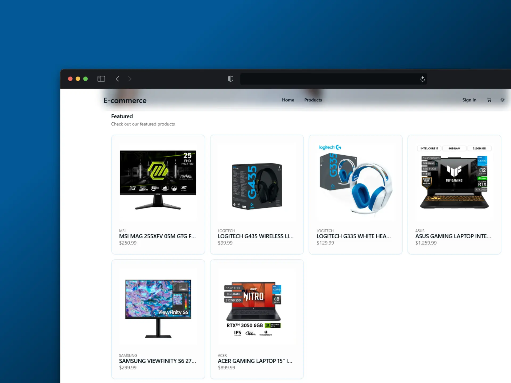

# 🛒 E-Commerce App

<div align="center">
<a href="https://e-commerce-a19.vercel.app/">

</a>
</div>

## 📌 About the Project

This is a **modern e-commerce application** built with the latest web technologies, providing a seamless shopping experience with an intuitive UI, powerful search functionality, and secure transactions.

## 🛠️ Tech Stack

<div align="center">


</div>

## 🚀 Features

✅ **User Authentication & Authorization** (JWT-based authentication)  
✅ **Product Management** (Create, Read, Update, Delete)  
✅ **Category Filtering & Search**  
✅ **Shopping Cart & Wishlist**  
✅ **Secure Checkout with Payment Integration**  
✅ **Admin Dashboard for Inventory & Orders**  
✅ **Responsive & Mobile-Friendly Design**  

## 🏗️ Installation & Setup

```bash
# Clone the repository
git clone https://github.com/Samuelsf22/e-frontend.git

# Navigate to the project directory
cd e-frontend

# Install dependencies
npm install

# Start the development server
npm run dev

## 🔗 Backend Connection

This frontend application is designed to work with a backend built using **Spring WebFlux**.  
If you want to test the full functionality, including authentication, product management, and checkout, you need to set up the backend service.

👉 **Backend Repository:** [E-Commerce Backend (Spring WebFlux)](https://github.com/Samuelsf22/e-backend)

By default, the frontend will display mock data when the backend is unavailable, ensuring a seamless experience even when offline.
